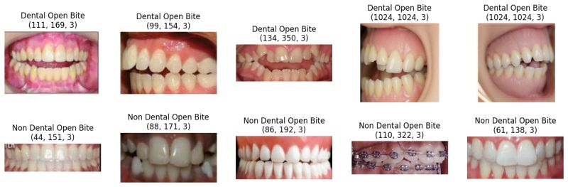

<h1 align="center">Dental Open Bite Detection</h1>

<h4 align="center">Automatically detecting the presence of dental open bite using traditional convolutional neural network (CNN) and transfer learning</h4>

 

Credit: <a href="https://www.orthodontistwilmington.com/">https://www.orthodontistwilmington.com</a>

<h2>Table of Contents</h2>

- [Overview](#overview)
- [Dataset](#dataset)
- [Model](#model)
- [Result](#result)

<h2>Overview</h2>

Dental open bite is a condition characterized by a lack of vertical overlap between the upper and lower teeth when the mouth is closed. Open bite can lead to various dental and facial issues, affecting aesthetics, speech and self-esteem - <a href="https://www.orthodontistwilmington.com/what-is-an-openbite/">orthodontistwilmington</a>.  
The objective of this project is to develop a model that can accurately detect whether a dental image exhibits signs of open bite or not. By leveraging traditional convolutional neural networks (CNN) and transfer learning techniques, I aim to create a solution for automated open bite detection in dental images.

<h2>Dataset</h2>

Due to unavailability of open bite dental images, I manually gathered a dataset of 1000 dental images from various sources on the internet. The dataset consists of 350 images labeled as open bite and 650 images labeled as non-open bite. The images are in JPEG format and have varying dimensions.

<h2>Model</h2>

I built three different variants of CNN networks: a traditional CNN, an Inception v3 model, and a VGG16 model. The traditional CNN was constructed using multiple convolutional and pooling layers, followed by dense layers, and was compiled with a categorical cross-entropy loss function and Adam optimizer. Inception v3 and VGG16 models were utilized as well, leveraging their pre-trained architectures for improved performance on the new dataset. These models were chosen to explore different approaches and compare their effectiveness in the task

<h2>Result</h2>

The performance of the three CNN variants was evaluated using precision, recall, and F1 score metrics. The results are summarized in the table below:

<table border="1">
  <tr>
    <th>Model</th>
    <th>Precision</th>
    <th>Recall</th>
    <th>F1 Score</th>
  </tr>
  <tr>
    <td>Traditional CNN</td>
    <td>0.626667</td>
    <td>0.712121</td>
    <td>0.666667</td>
  </tr>
  <tr>
    <td>VGG16</td>
    <td>0.630137</td>
    <td>0.696970</td>
    <td>0.661871</td>
  </tr>
  <tr>
    <td>Inception v3</td>
    <td>0.626866</td>
    <td>0.636364</td>
    <td>0.631579</td>
  </tr>
</table>

Although these results indicate relatively modest performance across all models, which can be attributed to the limited size of the dataset and class imbalance, this project nonetheless provides a solid foundation for future research and development in automated open bite detection. Future improvements might focus on expanding the dataset to include a larger and more diverse set of dental images, which is expected to enhance the model performance metrics significantly.

